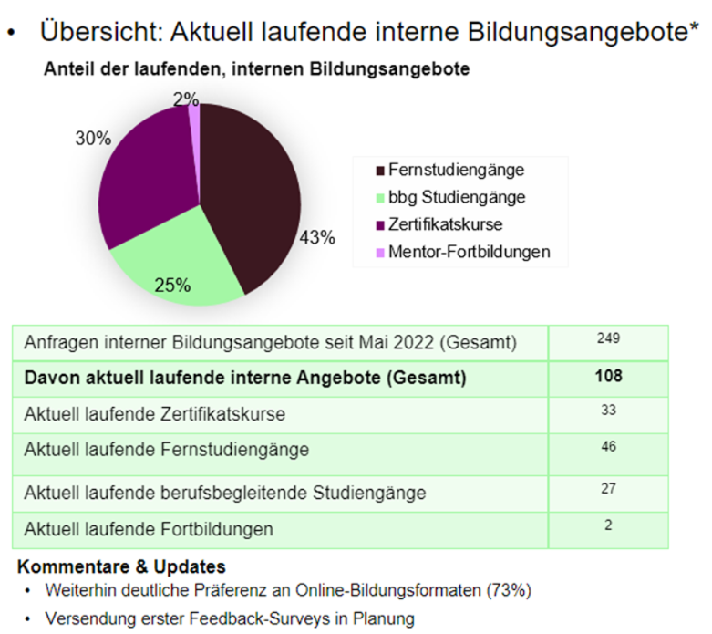
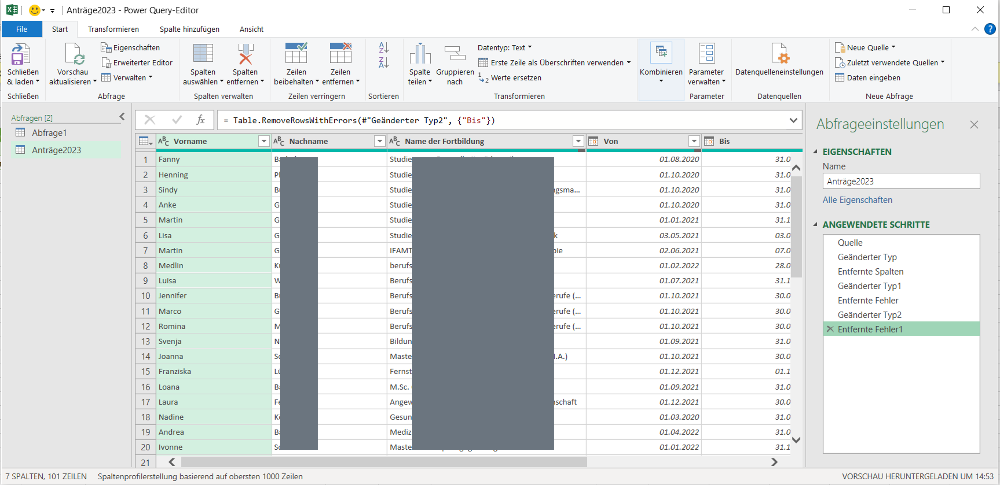
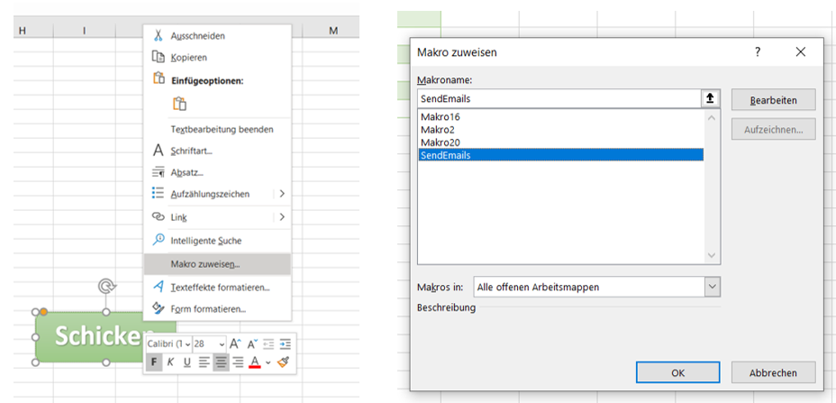

# From Inquiry to Action: Automating Emails with Excel

Author: Ting Hsuan Hsu

Project Created: 06/2023

## Background and Goals
This project was created during my work-study job at a talent development team in 2023. My role involved:

* Consulting on development opportunities internal & external
* Managed program inquiries following established cross-department process.
* Analyzed inquiry and participation data to improve program development.

**The Challenge: Low Participation**

As an educational group, it offers a wealth of educational resources, including free certificate courses, online degrees, and financial support for external learning opportunities. However, participation remains low. From May 2022 to May 2023, only 250 inquiries were made, with just 108 employees (5% of our 2,000+ workforce) ultimately enrolling.



While advertising and understanding employee needs are important, we need a more comprehensive approach. 

Here's our plan:

* **Gather Feedback:** We decided to implement a follow-up email system to gather feedback from program participants. This internal feedback will help us improve offerings, while external feedback can validate courses or even lead to internal training creation. 


**Starting Simple with Excel**

Unfortunately, there were no existing software or dedicated systems for sending follow-up emails. So, we opted for a basic solution using Microsoft Excel as a starting point. As the team member with the most extensive Excel knowledge, I took the lead on designing the solution. This involved incorporating valuable feedback from colleagues and crafting an effective email template.

## Solution Design

The solution part include following steps:

1. Data Preparation (Power Query)
2. Email Template Design with placeholders
3. Tips for sharability
4. Developer Tab enablement (one-time)
5. VBA code adpation (can also be found [HERE](docs/code_adaption.pdf))
6. Excution 

* **Step 1**: Data Preparation

Utilizing the exisiting maintaining list of program participants, with very detailed information, we further extract the relevant infomation via power inquiry to show those finished the courses.




  
* **Step 2: Design the Email Template:**

Create a sample email with placeholders for dynamic information, such as [name] and [course name]. These placeholders will be replaced automatically using VBA code. Save the template as a .msg file format.
Example mail:
``` 
Dear [name],

Congratulations on completing the development opportunity for [course name]!

We are confident you gained valuable knowledge and skills during the program. To help us improve future offerings, we'd appreciate your feedback on your experience. 

... (Include a call to action for feedback submission)

Sincerely,

The Talent Development Team
```
* **Step 3: Store the Template in a Centralized Location:**

Save the .msg template file in a readily accessible location, such as a shared folder, to ensure easy access for all colleagues.

* **Step 4: Enable the VBA Developer Tab (one-time):**

1. Open Microsoft Excel.
2. Go to File > Options.
3. In the Customize Ribbon section on the left, locate the Main Tabs checkbox list.
4. Check the box next to Developer.
5. Click OK.

* **Step 5: VBA code adaption:**

Create and Implement VBA Code:
1. Click on the newly added Developer tab.
2. Click Visual Basic
3. Click Insert > Module.
4. Paste the VBA code below to use for email automation within this module. Each line comes with explanation.
5. Adpet the code, please refer to the document here with clearer instruction [Follow Me](docs/code_adaption.pdf)


```
Sub SendEmails() ‘ name of this function is SendEmails
    
    Dim OutApp As Object
    Dim OutMail As Object
    Dim i As Integer
    Dim TotalRow As Integer
   
     ' call out outlook
    Set OutApp = CreateObject("Outlook.Application")
    
    ' Loop through the rows of data in the worksheet (how many rows ?)
    TotalRow = Range("A" & 100).End(xlUp).Row
    
    For i = 2 To TotalRow ‘ loop from row 2 to the end of data, row 1 is title 
                       
         ' Call out & create the email object based on example 
        Set OutMail = OutApp.CreateItemFromTemplate("C:\Users\P17082\OneDrive - COGNOS AG\Desktop\Email Template\Onboarding Feedback .msg")
        
        ' Set the email properties
        With OutMail
            .To = Range("B" & i).Value  ‘ Column B stored the value of email address
            .cc = “hrdevelopment@crf-education.com”
            .Subject = “Feedback “
            .HTMLBody = Replace(.HTMLBody, "(Insert Vorname)", Range("D" & i).Value)
               ' look for the specific word”(Insert Vorname)” in the template mail and replace with   
                Range("D" & i).Value, where D stored the value of Vorname  
            .Display
        End With
        
        ' Clean up the objects
        Set OutMail = Nothing
        
    Next i
    
    ' Clean up the objects
    Set OutApp = Nothing
    
End Sub
```

* **Step 6: Excution**

Before excution:
* Close the Template Mail
* Make sure Outlook App is open
* Save excel to „Macro file“type
* Try not to change the column sequence to avoid crash
* Make sure text are all in the „“, spelling is correct including upper/lower case, space etc.,

Make it Happen, assign it to a button:)
1. Go to Insert > Shapes (choose a shape).
2. Draw the button on your sheet.
3. Right-click the button and select Assign Macro.
4. Choose your VBA code name and click OK.



## Implementation and Results

To sum up, here's how we implemented the Excel-based email follow-up system:

1. **Data Preparation:** We compiled a list of program participants with their names, email addresses, and relevant course details.
2. **Template Integration:** The pre-designed email template (refer to Solution Design) was integrated into the Excel workbook.
3. **VBA Code Implementation:** The VBA code was implemented within an Excel module to automate email sending based on the participant data list. 
4. **Macro Button Creation:** A macro button was created on the Excel sheet for easy execution of the email automation process.

**The Impact of Automated Emails on Talent Development:**

While it's still too early to definitively measure the impact on program enrollment rates due to the recent implementation (a few months), the automated email follow-up system has already demonstrated positive results:

* **Improved Efficiency:**  VBA email systems save time by handling follow-ups within one click, freeing up team members from the tedious task of manually tracking completion dates and copying email content. This automation not only saves time but also adds a personalized touch to our communications.
  
* **Enhanced Program Quality:** Internal feedback mechanisms refine programs based on identified strengths and weaknesses, ensuring continuous improvement. Such as wish of more interactive content and hands-on exerices on certificate courses.
  
* **Greater Pool of Attractive Offerings:**  Incorporating validated external offers recommended by employees enriches our consultancy services, broadening our portfolio. 

* **Comprehensive Feedback Collection:** The automated system goes beyond talent development, enabling efficient feedback gathering during onboarding calls, showcasing its scalability.


